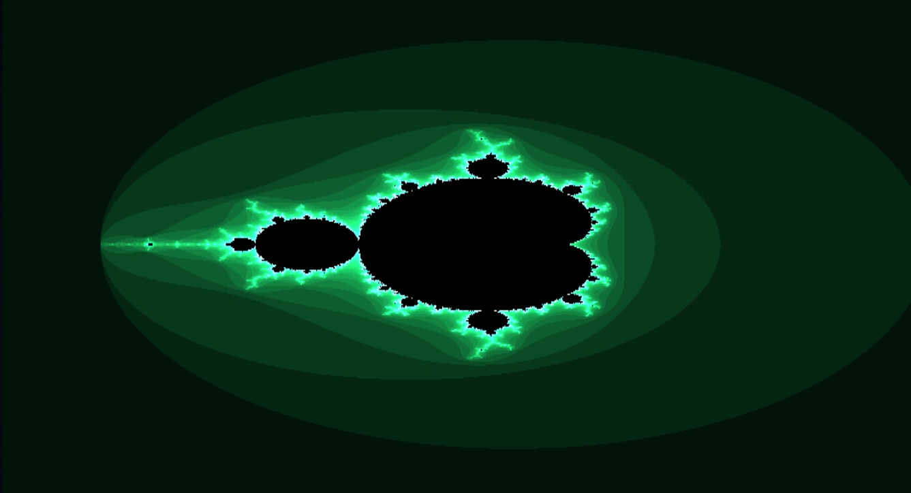

# Fractalite 🎨

[](https://opensource.org/licenses/MIT)
[](https://get.webgl.org/)


<div align="center">
  
</div>

## 🌟 Overview

Fractalite is a powerful, interactive fractal generator that brings the beauty of mathematical fractals to your browser. Built with WebGL for GPU-accelerated rendering, it allows you to explore and create stunning visualizations of complex mathematical structures in real-time.

## ✨ Features

- **Multiple Fractal Types**
  - Mandelbrot Set
  - Julia Set
  - Burning Ship fractal
  - More coming soon!

- **Interactive Controls**
  - Dynamic zooming and panning
  - Real-time parameter adjustments
  - Smooth navigation controls

- **Customization Options**
  - Color palette customization
  - Iteration depth control (Upcoming)
  - Resolution settings (Upcoming)
  - Export high-quality images

- **Performance**
  - GPU-accelerated rendering via WebGL
  - Optimized fragment shaders
  - Smooth real-time updates

## 🚀 Getting Started

### Prerequisites

- Modern web browser with WebGL support
- Node.js (v14 or higher) for development

### Installation

1. Clone the repository:
```bash
git clone https://github.com/yourusername/fractalite.git
cd fractalite
```

2. Install dependencies:
```bash
npm install
```

3. Start the development server:
```bash
npm run dev
```

4. Open your browser and navigate to `http://localhost:3000`

## 🎮 Usage

1. Select a fractal type from the dropdown menu
2. Use mouse/touch to zoom and pan:
   - Scroll to zoom
   - Click and drag to pan
3. Adjust parameters using the control panel:
   - Iteration depth
   - Color scheme
   - Resolution
4. Export your creation by right clicking on the canvas and selecting save image


## 🤝 Contributing

Contributions are welcome! Please feel free to submit a Pull Request. For major changes, please open an issue first to discuss what you would like to change.

1. Fork the repository
2. Create your feature branch (`git checkout -b feature/AmazingFeature`)
3. Commit your changes (`git commit -m 'Add some AmazingFeature'`)
4. Push to the branch (`git push origin feature/AmazingFeature`)
5. Open a Pull Request

## 📝 License

This project is licensed under the MIT License - see the [LICENSE](LICENSE) file for details.

## 🙏 Acknowledgments

- Inspired by the beauty of mathematical fractals
- Built with the help of the WebGL community

---

<div align="center">
  Made with ❤️ by Ishaan Singh
</div>
